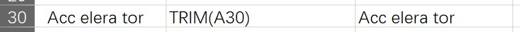

# Excel-DataAnalysis
## 清洗类函数
### LEFT ( TEST , [num_chars] )

    1. num_chars 从左边开始截取的字符数
    2. num_chars 为空，截取第一个字符
    3. num_chars 大于TEST长度，返回整个TEST
    4. num_chars 为0，返回空字符串
    5. num_chars 为负数，#VALUE!错误

### RIGHT ( TEST , [num_chars] )

    1. num_chars 从右边开始截取的字符数
    2. num_chars 为空，截取最后一个字符
    3. num_chars 大于TEST长度，返回整个TEST
    4. num_chars 为0，返回空字符串
    5. num_chars 为负数，#VALUE!错误

### MID ( TEST , START_NUM , [num_chars] )

    1. START_NUM 起始位置
    2. num_chars 截取的字符数
    3. START_NUM 大于TEST长度，返回空字符串
    4. START_NUM、num_chars 为负数，#VALUE!错误
   
### LEN ( TEST )

    返回字符个数

### LENB ( TEST )

    返回字符串长度，一个汉字长度为2，英文字符长度为1

### CONCATENATE ( TEXT1 , TEXT2 , ... )

    连接多个字符串

### TEXT ( VALUE , FORMAT_TEXT )

### TRIM ( TEXT )

    去除单元格前后的空格，中间的空格不会去除

### REPLACE ( OLD_TEXT , START_NUM , NUM_CHARS , NEW_TEXT )

    1. OLD_TEXT 要替换的字符串
    2. START_NUM 起始位置
    3. NUM_CHARS 替换的字符数
    4. NEW_TEXT 新的字符串

### SUBSTITUTE ( TEXT , OLD_TEXT , NEW_TEXT , [INSTANCE_NUM] )

    1. TEXT 要替换的字符串
    2. OLD_TEXT 要替换的字符串
    3. NEW_TEXT 新的字符串
    4. INSTANCE_NUM 第几个要替换的字符串，不填写则全部替换

### FIND ( FIND_TEXT , WITHIN_TEXT , [START_NUM] )

    1. FIND_TEXT 要查找的字符串
    2. WITHIN_TEXT 被查找的字符串
    3. START_NUM 起始位置
    4. 区分大小写
   
### SEARCH ( FIND_TEXT , WITHIN_TEXT , [START_NUM] )   

    1. FIND_TEXT 要查找的字符串
    2. WITHIN_TEXT 被查找的字符串
    3. START_NUM 起始位置
    4. 不区分大小写

## 时间类函数